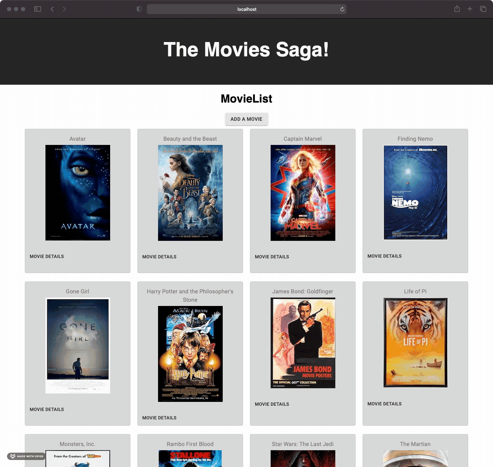

# Weekend Movie Sagas

## Description

_Duration: Weekend_

In this project I was presented with a partially built application, that stored movie details in a database. The application had a GET request to a database that would store movie information in Redux. I was tasked to complete the application by adding a feature that would allow a user to select a movie and send them to a movie details page. This movie details page, shows the user the title, poster image, genres, and a description of the movie they clicked on. A Back To Movies button is displayed to take the user back to the home page.

The second feature tasked to complete was to setup a page which allows the user to add a new movie. The new page takes in text for a movie title, an image url (movie poster), a movie description, and a drop down selector for genre. On submission, this will capture the data, send it to a database, and then render the new movie to the home page. The newly rendered movie will display along with a movie details button.

To see the fully functional site, please visit: [DEPLOYED VERSION OF APP](https://arcane-savannah-13609.herokuapp.com/#/)

## Screen Shot

### Prerequisites

- [Node.js](https://nodejs.org/en/)
- [Postico](https://eggerapps.at/postico/)
- PostgreSQL

## Installation

1. Fork and clone project
2. Open with the editor of your choice
3. Create a database through Postico called `saga_movies_weekend`
4. Data to setup table found in `database.sql` file
5. Open terminal and run `brew services start postgresql`
6. Run `npm install` to get dependencies for `package.json`
7. Split terminal window
8. `npm run server`
9. `npm run client`
10. Browser will load and direct to `http://localhost:3000`
11. When finished in each terminal window press `control + C` to stop server and client
12. Stop postgresql in terminal with `brew services stop postgresql`

## Usage

To use this application:

1. On home page load, a movie list with several movie posters will appear.
2. A user may either click on any of the [Movie Details] button or click on the [Add A Movie] button.
3. Upon [Movie Details] button click, the user will be sent to a details page about that individual movie.
4. A [Back To Movies] button can be clicked to send the user back to the movie list.
5. On the home page, if the [Add A Movie] button is clicked the user will be sent to the add movie page.
6. The user will see several inputs for them to add a movie of their choosing.
7. If the user does not want to add a movie, they can select [Cancel] which will send them to the home page.
8. If the user fills out the input fields, they can click [Save].
9. The save button captures the data put in and sends it to the database.
10. The user will be sent back to the home page where they will see the newly added movie.
11. The new movie can then be clicked on to view the movie details.

## Built With

- Redux-Saga
- Redux
- React
- Node.js
- Express.js
- PostgresSQL
- Heroku
- Javascript
- Material-UI
- HTML
- CSS

## Acknowledgement

Thanks to Prime Digital Academy who equipped and helped me to make this application a reality.

## Support

If you have suggestions or issues, please email me at terry.okeefe87@gmail.com